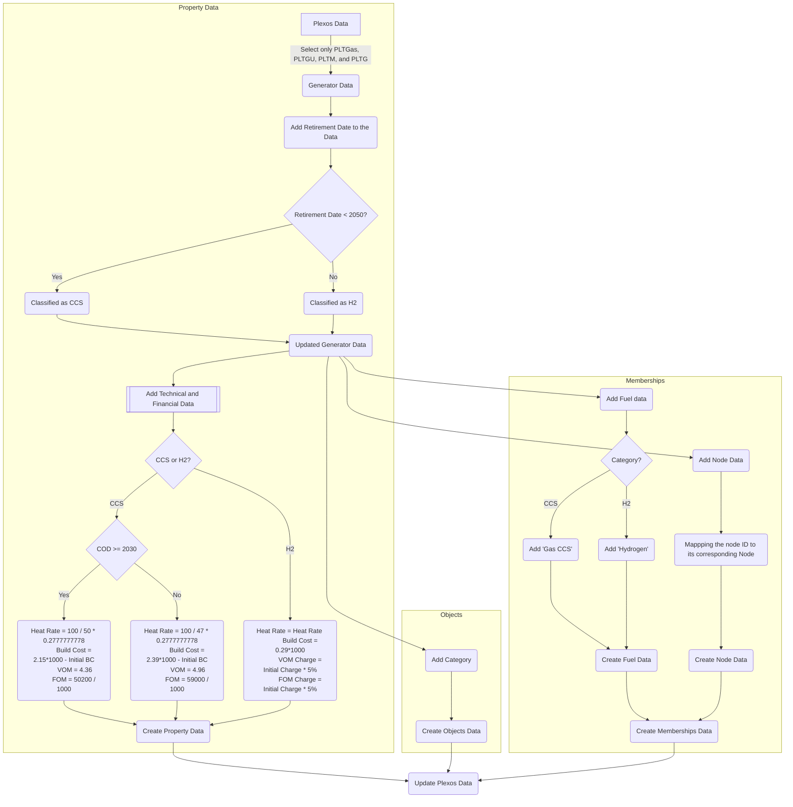

```mermaid 
flowchart TD
    subgraph "Property Data"
        direction TB 
        A[Plexos Data] -->|Select only PLTGas, PLTGU, PLTM, and PLTG| B(Generator Data)
        B --> C(Add Retirement Date to the Data)
        C --> D{Retirement Date < 2050?}
        D --> |Yes| E(Classified as CCS)
        D --> |No| F(Classified as H2)
        E --> G(Updated Generator Data)
        F --> G
        G --> H[[Add Technical and Financial Data]]
        H --> S1
                S1{CCS or H2?} --> |CCS| S2{COD >= 2030}
        S2 --> |Yes| S3
        S2 --> |No| S4
        S3( Heat Rate = 100 / 50 * 0.2777777778
            Build Cost = 2.15*1000 - Initial BC
            VOM = 4.36
            FOM = 50200 / 1000)
        S4( Heat Rate = 100 / 47 * 0.2777777778
            Build Cost = 2.39*1000 - Initial BC
            VOM = 4.96
            FOM = 59000 / 1000)
        S1 --> |H2| S5
        S5( Heat Rate = Heat Rate 
            Build Cost = 0.29*1000
            VOM Charge = Initial Charge * 5%
            FOM Charge = Initial Charge * 5%
        )
        S3 --> S6(Create Property Data)
        S4 --> S6
        S5 --> S6 
    end    
    subgraph Objects 
        direction RL  
        G --> O1(Add Category)
        O1 --> O2(Create Objects Data)
    end 
    subgraph Memberships
        G --> M1(Add Fuel data)
        M1 --> M2{Category?}
        M2 --> |CCS| M3(Add 'Gas CCS')
        M2 --> |H2| M4(Add 'Hydrogen')
        M3 --> M5(Create Fuel Data)
        M4 --> M5 
        G --> M6(Add Node Data)
        M6 --> M7(Mappping the node ID to its corresponding Node)
        M7 --> M8(Create Node Data)
        M5 --> M9(Create Memberships Data)
        M8 --> M9
    end 
    S6 --> S(Update Plexos Data)
    O2 --> S
    M9 --> S
```
