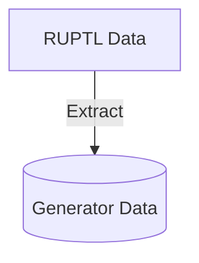
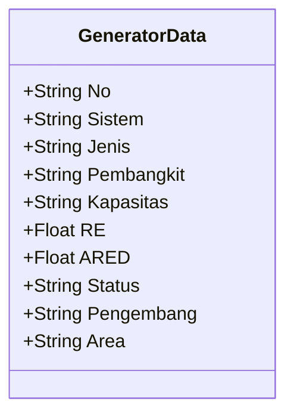

```mermaid 
flowchart TD

    A[RUPTL Data] -->|Extract| B[(Generator Data)]
```

```mermaid 
classDiagram
    Generator Data : +String No
    Generator Data : +String Sistem
    Generator Data : +String Jenis
    Generator Data : +String Pembangkit
    Generator Data : +String Kapasitas
    Generator Data : +Float RE
    Generator Data : +Float ARED
    Generator Data : +String Status
    Generator Data : +String Pengembang
    Generator Data : +String Area
```
